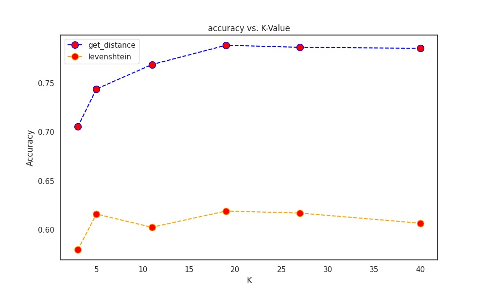

# M1-PJE-PATHER

2022 - Master 1 Machine Learning - PJE C

# Auteur

```
Nom : Pather
Prénom : Stevenson
Email : stevenson.pather.etu@univ-lille.fr
```

# Analyse de sentiments sur Twitter

# HowTo

## Librairies

Il est nécessaire d'installer les lib python suivante pour le bon lancement du programme :

* pandas
* numpy
* tweepy
* requests
* requests-oauthlib
* levenshtein
* scikit-learn
* sphinx

Pour cela vous pouvez directement utiliser la commande make suivante :

```
$ make lib
```

Qui va lancer le script install_lib.sh qui utilisera pip3 pour installer les lib.

## Documentation

Pour générer la documentation à l'aide de sphinx, utilisez la commande make suivante :

```bash
$ make doc
```

La documention générée sera ainsi dans le dossier *doc/* à la racine du projet.

## Description du projet

## Problématique

Le projet porte sur le développement d'une application d'analyse de comportements de Twitter à partir d'une base d'apprentissage et 
de modèles de classification pour permettre de classer de nouveaux tweets.

### Architecture

Nous avons fait le choix d'utiliser python comme langage de programmation pour implémenter ce projet.

...

## Détails des différents travaux réalisés

### API Twitter

L'utilisation de l'API Twitter est faite à l'aide de la librairie *tweepy* de python. 

Nous utilisons un fichier local contenant les différents tokens d'authentification pour l'API : [credentials.json](./credentials.json) .
Puis à l'aide du programme [auth.py](src/auth.py), nous créeons un client qui nous permettera de communiquer avec l'API Twitter.

Exemple : 

```py
client = authpy()
tweets = client.search_recent_tweets(query="les anneaux de pouvoir",tweet_fields=['context_annotations'], max_results=100)
```

Ainsi à l'aide de la méthode *search_recent_tweets*, nous pouvons récupérer un objet contenant un nombre donnée de tweets récents avec leurs informations à partir une query donnée pour cibler le sujet du tweet.

De cette manière nous avons pu récupérer un total de 3000 tweets français concernant 6 sujets/query. Soit un total de 500 tweets par sujet :

- JO 2024

- Equipe de Lens

- Sandrine Rousseau

- Vlille

- les anneaux de pouvoir

- House of the dragon

### Préparation de la base d'apprentissage

#### Nettoyage des données

Pour nettoyer les données nous avons dans un premier temps formuler une expression réuglière pour pouvoir éliminer le plus de séquences textes indésirables à la classification de nos tweets. Pour cela nous avons utiliser la librairie *re* de python qui permet l'application d'expression régulière en filtrage à des chaînes de caractères.

On retrouve donc la fonction *clean_tweet* dans le fichier [src/clean_basis.py](src/clean_basis.py)

#### Construction de la base

Pour construire la base nous avons exécuter pour récupérer 500 tweets par sujets en respectant les contraintes de nombre de requête faite à l'API dans un certains temps, pour former une 
base de 3000 tweets que l'on a enregristé au format CSV dans le fichier : [src/data/basis_learning/tweets.csv](src/data/basis_learning/tweets.csv)

Puis avec le programme [src/main_basis](src/main_basis.py)
nous créeons un DataFrame à l'aide de la librairie pandas à partir du fichier *tweets.csv. Nous nettoyons les tweets et retirons les tweets doublons.

Enfin nous annotons les tweets à l'aide de la fonction *get_polarity* du fichier [polarity.py](src/polarity.py),
qui permet à partir des fichiers de classes contenus dans [src/data/classes/](src/data/classes/) de récupérer les mots qui consituent les classes positives et négatives. L'annotation est faite en prenant la classe qui obtient le maximum d'occurrences des mots qui la composent présent dans un tweet donné. Si les occurrences dans un tweet sont égales pour les 2 classes alors il est considéré de la classe neutre.

Pour lancer ce programme :

```bash
$ make main_basis
cd src/ && python3 main_basis.py
Starting main_basis.py Twitter Sentiment Analysis :

         - pandas.DataFrame("data/basis_learning/tweets.csv") loaded ✓
         - tweets of DataFrame have been cleaned  ✓
         - Duplicate tweets have been removed : 99 duplicates  ✓
         - The polarity of the tweets has been changed ✓
         - DataFrame saved in csv file : data/basis_learning/tweets_clean_annoted.csv  ✓
```

Ainsi grâce à cette annotation automatisée nous n'avons aucun tweet non classé.

La base construite est donc sauvegarder dans le fichier [src/data/basis_learning/tweets_clean_annoted.csv](src/data/basis_learning/tweets_clean_annoted.csv)

### Algorithmes de classification

L'utilisation autant que possible des structures et méthodes que permet la librairie *numpy* est faite dans les implémentations.

#### KNN

L'implémentation de la méthode des k plus proches voisins est faite au travers d'une classe [KNN.py](src/KNN.py).

Celle-ci prend en argument une fonction de distance et un nombre $`k`$ de voisins, qui a une valeur à 19 par défaut affecté suite aux analyses faites.

Les méthodes principales sont :

* fit(X,y): qui permet d'enregistrer les données avec X un vecteur de tweets et y le vecteur étiquette/True label de ceux-ci
* nearest_neighbors_predict(tweet) : pour un tweet donné retourne l'étiquette la plus présence parmis les k voisins de la base d'apprentissage donné à la méthode fit préalamblement
* predict(X_test): qui retourne un vecteur contenant les étiquettes prédites pour un vecteur X_test de tweets donné
* score(X_test,y_test) : retourne l'accuracy des prédictions faite par le modèle pour le vecteur de tweet X_test par rapport aux étiquettes de ce vecteur qui est y_test

Concernant les fonctions de distances, nous avons implémenter la fonction D donnée dans les consignes : D(t1,t2) = (Nombre total de mots – nombre de mots communs) / nombre total de mots.
Et également la distance de Levenshtein qui sont disponible en fonction en début de fichier [KNN.py](src/KNN.py).

Pour pouvoir trouver le nombre de voisins et la fonction de distance qui permet de maximiser l'accuracy, nous proposons la méthode par gridsearch pour trouver les hyperparamètres.

Nous avons donc implémenter une fonction *gridsearch* dans le fichier [src/GridSearchKNN.py](src/GridSearchKNN.py), qui prend en paramètre un vecteur X de tweets et le vecteur y_true d'étiquettage.

Pour effectuer la recherche par grille nous effectuons un split des données en un ensemble d'entraînement et de test, puis nous entraînons notre modèle KNN avec l'ensemble d'antrînement. Ensuite pour chaque fonction de distance et chaque nombre de valeurs parmis $`[3,5,11,19,27,40]`$ nous calculons le score en généralisation du KNN pour ce nombre de voisins considérés et avec les données de tests. Puis nous enregistrons un plot de la matrice de confusion des résultats. Enfin nous enregistrons un graphe de l'accuracy en fonction du nombre de voisins pour les deux fonctions de distances pour comparer les résultats.

Voici les matrices de confusion :

* get_distance (D) :


* Levenshtein :


* Graphe GridSearch :



Ainsi nous obtenons une stagnation de l'accuracy à un nombre de voisins autour de 19 et nous obtenons de meilleurs résultats avec la fonction de distance get_distance. Nous prenons donc ces paramètres en valeur par défaut pour la création d'un objet KNN.

#### Bayes et variantes

l'implémentation de la classification bayésienne est permis ici grâce à la classe [BayesClassifier.py](src/BayesClassifier.py)

Ainsi dans cette classe nous utiliserons le théorème de Bayes des probabilités sachant les données, par présence, fréquence et avec ou sans combinaisons des n-grammes. 

L'application d'une fonction de lissage par un estimateur de Laplace est effectué pour l'entraînement du modèle sur les données. Ainsi qu'une discrimination des mots inférieur d'une longueur égale à 3.

Cette classe nécessiste trois arguments :

* freq : choix de la représentation, True pour fréquence False pour Présence
* n_gram : 1 pour uni-gramme, 2 pour bi-gramme,
* combinaison : True si l'on souhaite entre une combinaison de uni-gramme + et bi-gramme

Les méthodes pricipales sont :

* fit(X,y) : entraîne le modèle sur le vecteur de tweets X et y vecteur étiquette
* _predict(tweet) : méthode privée qui applique le théorème en fonction pour prédire l'étiquette la plus probable calculer pour le tweet donnée en paramètre
* predict(X_test) : méthode publique qui applique par vectorisation la méthode privée _predict pour obtenir le vecteur de prédiction du vecteur X_test de tweets
* score(X_test,y_test) : retourne l'accuracy des prédictions faite par le modèle pour le vecteur de tweet X_test par rapport aux étiquettes de ce vecteur qui est y_test

### Interface graphique

La partie concernant l'interface graphique n'a malheureusement pu être plus traité que l'ébauche effectuée en PyQT5/6 lors d'une avance prise en début de semestre : [src/gui](src/gui/)

## Résultats de la classification avec les différentes méthodes et analyse

Dans un premier temps nous avons implémenter une fonction de cross-validation pour mêner à bien l'analyse de nos résultats.
Cette implémentation est disponible dans le fichier [src/cross_validation.py](src/cross_validation.py)

Cette fonction *cross_val_score* prend quatre arguments :

* X : un vecteur de tweets
* y : le vecteur d'étiquette associé à X
* k : le nombre de folds que l'on souhaite
* estimator : un modèle comme KNN ou BayesClassifier

Cette fonction retourne l'accuracy en moyenne des k-folds de la cross-validation effectuée.

Ainsi nous avons dans un premier temps récupérer notre base d'apprentissage dans un dataframe, puis créer la liste des modèle *BayesClassifier* suivant :

```py
models = [BayesClassifier(freq=False,n_gram=1), 
          BayesClassifier(freq=False,n_gram=2),
          BayesClassifier(freq=False,n_gram=2,combinaison=True),
          BayesClassifier(freq=True,n_gram=1),
          BayesClassifier(freq=True,n_gram=2),
          BayesClassifier(freq=True,n_gram=2,combinaison=True)]
```

Qui représente dans l'ordre les classifications bayésienne suivante :

```py
labels = ['Présence, uni-gramme', 'Présence, bi-gramme',
         'Présence, uni-gramme + bi-gramme',
         'Fréquence, uni-gramme','Fréquence, bi-gramme',
         'Fréquence, uni-gramme + bi-gramme']
```

Nous obtenons la liste des scores en cross-validation en 10-folds de ces classifications : 

```py
scores = np.array([cross_val_score(X,y,10,m) for m in models])
```

Ainsi on peut obtenir choisir la meilleure classification :

```py
>>> labels[scores.argmax()], scores[scores.argmax()]
('Présence, uni-gramme', 0.647020974049058)
```

On obtient donc un meilleur *BayesClassifier* avec la considération en présence de manière uni-gramme pour une accuracy de 0.64.

Nous avons également lancer la cross-validation pour un *KNN* avec une cross-validation 10-folds. La finilisation de l'exécution de celle-ci a pris un certain temps (quelques minutes):

```py
>>> cross_val_score(X,y,10,KNN())
0.7938535371489512
```

Nous obtenons donc une accuracy de 0.79 ce qui est mieux que pour *BayesClassifier*.

Concernant la sur-représentation de la classe d'étiquette 2 (neutre) on peut se demander l'intérêt de nos modèles si celle-ci est omniprésente dans nos données car un algorthime de classification absurde qui retournerait volontairement toujours une prédiction de classe 2 quelques soit les données pourrait alors obtenir un taux d'erreur faible. Cette question pourrait être pousser pour apppuyer l'intérêt de nos résultats si un tel algorithme absurde n'obtiendrait pas de bon résultats.

Une trace de ces analyses ainsi qu'une démonstration sur de nouveaux tweets récupérer à l'aide l'API est disponible dans le fichier [src/analyse.ipynb](src/analyse.ipynb) .

## Conclusions

Nous avons pu implémenter des modèles de classification en utilisant des algorithmes comme KNN ou encore bayes avec des variantes dans le but de pouvoir prédire si des nouveaux tweets en généralisation sont négatif, neutre ou positif. 

Cela fut possible dans premier temps grâce à la manipulation de l'API Twitter pour pouvoir récupérer de la données pour pouvoir nettoyer et construire une base d'apprentissage.

Puis des questions d'optimisation d'hyperparamètre se sont poser dans le but d'améliorer la précision de nos modèles comme par exemple le nombre de voisins considérés ou la fonction de distance pour KNN qui a nécessisté une recherche par grille.

L'utilisation de théorème de Bayes pour classifier des textes dans un contexte multi-classes nous a permis d'étudier des variantes et critères qui peuvent être appliquer pour l'entraînement ou la prédiction de la classfication comme le lissage par Laplace, la longueur des mots retenues ou encore le nombre de mots à la suite conserver pour former le N-gramme mots du vocabulaire.

Enfin l'analyse et comparaisons de la performance des classfications ont exposés la nécessité de devoir utiliser des techniques comme la validation croisée pour mesurer la qualité de nos modèles de manière efficace et venir valider ou non nos modèles en généralisation.